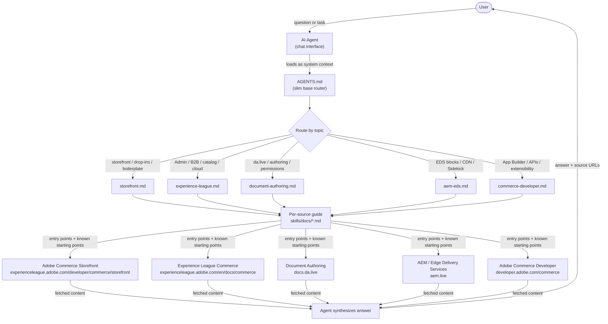
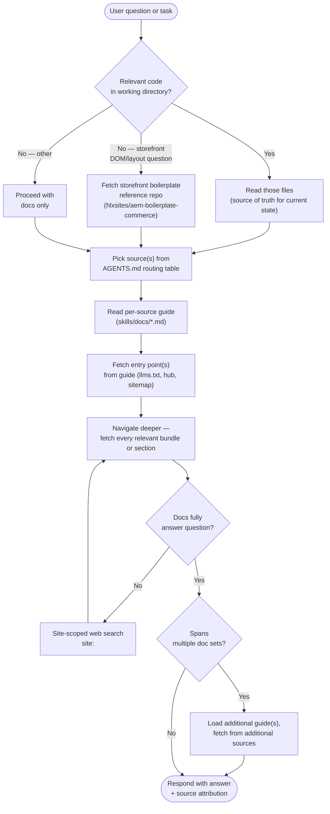
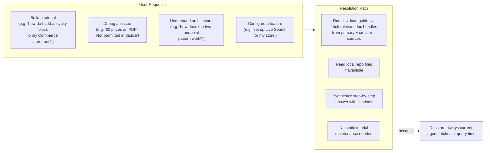

# AGENTS.md Pattern — Architecture

A documentation-routing pattern for AI agents working across Adobe Commerce's distributed doc ecosystem.

---

## 1. System Overview

How a user question travels through the system to a sourced, attributed answer.



---

## 2. Agent Workflow

How the agent executes a query.



---

## 3. Documentation Source Map

Each source has a primary niche; overlapping zones are handled by the routing rules in AGENTS.md.

```mermaid
flowchart LR
    subgraph StorefrontDocs["Storefront Docs"]
        SF1["Drop-in components"]
        SF2["Commerce blocks & boilerplate"]
        SF3["Storefront GraphQL / config"]
        SF4["Cart · Checkout · Account"]
        SF5["Storefront SDK & events"]
    end

    subgraph ExperienceLeague["Experience League"]
        EL1["Admin UI workflows"]
        EL2["B2B — companies, POs, quotes"]
        EL3["Catalog, inventory, promotions"]
        EL4["Commerce on Cloud (PaaS / ACCS / ACO)"]
        EL5["Live Search · Product Recs · Catalog Service"]
        EL6["Troubleshooting Knowledge Base"]
    end

    subgraph DADocs["Document Authoring"]
        DA1["da.live authoring interface"]
        DA2["Org & site setup"]
        DA3["Permissions & ACL sheet"]
        DA4["Preview / publish workflow"]
    end

    subgraph AEMDocs["AEM / EDS"]
        AEM1["Project anatomy & Code Sync"]
        AEM2["Generic blocks & markup"]
        AEM3["CDN, headers, go-live"]
        AEM4["Sidekick & Admin API"]
        AEM5["Spreadsheets, redirects, sitemap"]
    end

    subgraph DevDocs["Developer Docs"]
        DEV1["App Builder & extensibility"]
        DEV2["REST & GraphQL web APIs"]
        DEV3["API Mesh & webhooks"]
        DEV4["Admin UI SDK"]
        DEV5["Storefront events SDK"]
    end

    StorefrontDocs <-->|"backend data behind storefront"| ExperienceLeague
    StorefrontDocs <-->|"EDS mechanics, Sidekick"| AEMDocs
    StorefrontDocs <-->|"DA authoring on same site"| DADocs
    StorefrontDocs <-->|"SDK APIs, events"| DevDocs
    AEMDocs <-->|"DA publishes via EDS"| DADocs
    ExperienceLeague <-->|"API reference detail"| DevDocs
```



---

## 4. File Structure

```
skills/
  AGENTS.md              ← slim base (~120 lines): operating principles,
                            routing table, boilerplate repos, reading user
                            code, disambiguation examples, terminology
  docs/
    storefront.md        ← entry points, navigate deeper, known starting
    experience-league.md    points, site-scoped search, cross-refs for
    document-authoring.md   each of the five documentation sources
    aem-eds.md
    commerce-developer.md
```

The base `AGENTS.md` is loaded as system context. Per-source guides are loaded on demand when the routing table identifies a relevant source. This allows project-specific `AGENTS.md` files to import only the relevant subset of guides (e.g. a storefront repo imports `storefront.md` + `aem-eds.md` + `document-authoring.md`; a backend integration repo imports `experience-league.md` + `commerce-developer.md`).

---

## 5. Key Design Principles

| Principle | What it means in practice |
|---|---|
| **Fetch first, name names second** | Specific names (classes, fields, config keys, URLs) are only stated after fetching — never from training data |
| **Modular per-source guides** | Each doc source's navigation details live in its own file, loaded only when needed. Consistent template across all guides makes them easy to maintain and selectively import. |
| **Code can beat docs — but confirm first** | Local code (storefront, App Builder, API Mesh, PHP module) may reflect the user's actual state; confirm it's current before treating it as authoritative over docs |
| **Public sources only** | No internal Slack, dashboards, or Adobe-employee-only resources are cited |
| **Attribution required** | Every answer cites the doc URL(s) used; if the answer isn't in the docs, say so and point to Adobe support |
| **No invented URLs** | Only URLs retrieved in-session or listed in AGENTS.md / the loaded per-source guide are cited |

---

## 6. Primary Use Cases


